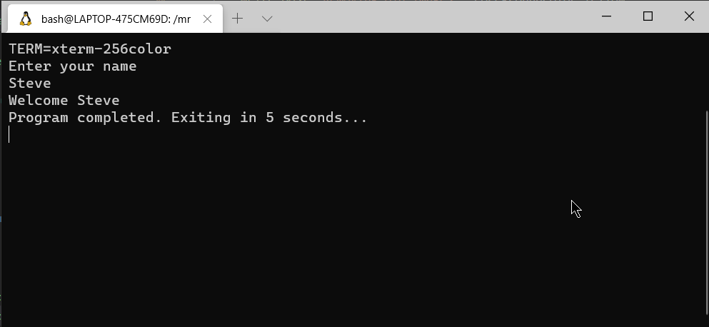

# Synopsis

This repo serves as a blank-slate for developers who are interested in containerizing VT100 Telnet/SSH applications. Anyone interested in this approach is more than welcome to fork this repository and customize it to their own needs. PR's however are always welcome!

When you fork/customize/build this container, you will be able to easily create telnet/SSH applications and tailor them to your own needs. 

Simply create your app as you would create any other console app (e.g. node.js, .net core, etc) and let this container do the heavy lifting to easily and seamlessly service that app to your end users. 

Some sample use cases for building such text-based terminal applications include (but not limited to):

* Inventories / Cycle Counts
* Warehouse Management Systems (shipping/receiving/pick/pack/putaway/etc.)
* Item inquiries (e.g. scan a barcode to inquire price/UOM/description/quantity on-hand/etc.)
* EDI outbound scanning (e.g. ASC X12 856 + MH10 labels)
* Gate checkout / theft prevention

# Introduction

I developed this docker container where I saw a need for businesses who require a text-based VTxxx interface to easily customize and automate their operations (e.g. text-based VT100 data capture scanner guns, WindowsMobile/CE rugged handheld devices with a VT100 client, etc.). Many businesses have a substantial investment in these perfectly-functional older devices, but there appears to be a growing trend in the enterprise world where businesses who have such datacapture requirements are otherwise expected to liquidate their legacy scanner investment for newer technologies, even when their present scanner tech will suffice. 

Unfortunately many enterprise software solutions lately have dropped legacy VT100 support from their products/services over the years, despite that such text-based data capture devices from vendors such as Zebra and Intermec are still **very much** the norm, not the exception. Android and iOS-based handhelds (and the improved UIs they bring) are still a vast minority in this field (anecdotally, but that has been my experience). I feel that many solutions miss the target completely on this large legacy audience. 

Developing a warehouse HTML5 app for Windows CE is an uphill battle (CE/Webkit-powered Zetakey is slow and memory hungry). Don't even get me started on .NET Compact Framework development.

By taking an old-school approach with a modern twist (e.g. VTxxx telnet/ssh applications hosted in a docker container) my goal is for developers to truly achieve create code that is *write once / run anywhere* (so long as the device has decent VT escape sequence support!).

By forking and customizing this container to your needs, you can create any console-based application in any language to your liking (presently this container supports node.js/typescript, .net core, and python) and then expose that application via both telnet (port 10023:23) and ssh (port 10022:22) without having to fuss with coding your own TCP server socket layer plumbing. Why reinvent the wheel when linux has mature remote shell capabilities via openssh and telnetd :) Containerizing solutions such as this only seemed natural. 

So long as you have a device that can connect via SSH or Telnet, I hope this containerized solution solves some needs for you!

# Technical details

This debian-based docker container will install the following programming languages and tools to facilitate whatever console app you want this container to run:

* Install node.js 10.x LTS + typescript
* Install .NET Core 2.2 SDK
* Install Python 2.7
* Install Powershel Core (pwsh)
* Install dosemu (for running dos applications)
* Install git (in case you prefer to git clone your app into the container @ build)
* Install misc. utilities such as curl, wget, dialog, etc.

The sections for each programming-language install is well documented in the dockerfile. Feel free to remove the languages you don't need, or add others to suit your needs (e.g. Mono, Java, Perl, Ruby).

Once these are installed, the dockerfile then installs a several "hello world" apps I wrote to demonstrate the container in action. See the bottom section of the dockerfile, this is where you will benefit most in customizing this container to your needs.

Currently there are several "htllo world" apps included in this dockerfile for the following

* /dos/myapp.bat: "hello world" in dosemu
* /dotnetcore/myapp.cs: "hello world" in dotnet core 2.2
* /nodejs/myapp.js: "hello world" in node.js
* /powershellcore/myapp.ps1: "hello world" in powershell core
* /python/myapp.py: "hello world" app in python

Refer to runcontainer.bat and runcontainer.sh for windows and linux examples on building the container. 

If you want to omit what ptty services are exposed, simply omit one of them from your docker run command e.g.

* `-p 10023:23` exposes telnet on port 10023
* `-p 10022:22` exposes ssh on port 10022

Omitting both will obviously render the container useless!

Some pros/cons of each:

* telnet
  * excellent legacy device support (nearly everything supports telnet)
  * no encryption (do NOT serve this container in the public. on-premise only)
  * easily bypasses linux username/password prompt (i.e. take you directly into the app)
* SSH
  * requires an SSH client (e.g. JuiceSSH for Android, Termius for iOS, etc) which isn't common on older devices
  * encrypted traffic to prevent sniffing
  * rebuilding the container will generate a new SSH server key (which can be a hassle)
  * extra hoops are needed (e.g. persistent container volumes) if public/private key auth is desired to skip user/password prompt

When the container is running, users connecting to this containerized service via telnet will skip the login prompt and immediately be taken into the running console app (in my experience, applications such as this usually have their own customized authentication controlled within the app anyways e.g. database or AD/AAD credentials). Users however connecting via ssh will be prompted for a the contasiner's linux user/password for connecting (which in the dockerfile is set up as root/password) - upon successful authentication, the user is taken into the same console app. If ssh public/private keys are preferred (thus bypassing root login for SSH), feel free to incorporate this into your dockerfile / docker run (pull requests are welcome!)

For SSH application access, users need to provide root credentials (if someone would like to fork and offer a PR to implement SSH authentication keys, I'd be more than happy to review). However, I've taken measures to harden SSH access so for SSH bash sessions, the user will only be able to reach the intended console app. Once the app exits, the connection is terminated. I've also ensured that users cannot use the ssh userid/password to SFTP into the container. Since this is a containerized application, any attack vectors are neglidgable. 

Feel free to fork this repository and customize it to your needs. 

# Connection and shell script execution workflow

Depending on how a user connects into your app, the workflow is as follows:

* For SSH: ssh connect >> ssh login >> .bashrc >> login-app.sh >> myapp.* >> exit
* For Telnet: telnet connect (login bypass) >> login-app.sh >> myapp.* >> exit

As you can see from the above connection methods, myapp.* is the console app that is run. 

# File contents

* dockerfile: self-explanatory
* .bashrc: called when a user connects to your app via SSH. Do not modify this
* keepalive.sh: this is the command that the dockerfile CMD runs. It currently launches the telnet and ssh server then goes into an infinate keepalive loop to keep the container running
* login-app.sh: .bashrc (for ssh) and telnetd fire off this script when a telnet/ssh connection is established. Feel free to customize this.
* runcontainer.bat and runcontainer.sh: windows and linux examples to run the container
* sshd_config: allows root ssh shell login and prohibits sftp access to the container
* telnet: configuration file for telnetd. Do not modify. Note the "server_args" parameter which instructs telnet to skip user login and immediately launch /root/login-app.sh
* myapp.*: various "hello world" examples in various languages 

When pressed, the app exists and the ssh/telnet connection is closed. 

# Important notes

Feel free to modify login-app.sh, but **ALWAYS** add an "exit" line at the end of your script. If you don't, when your custom app exits, the user will drop to a root shell session in the container. You don't want that :)

If you need to locally shell into the container for debugging/troubleshooting (e.g. docker run -it...), specify a shell OTHER than bash (e.g. sh). Since the container's .bashrc file for the root account directs the user to the console app then exists, you'll need to use a different shell to dive in 

# Screenshots

Sample screenshot of myapp.py in action:

